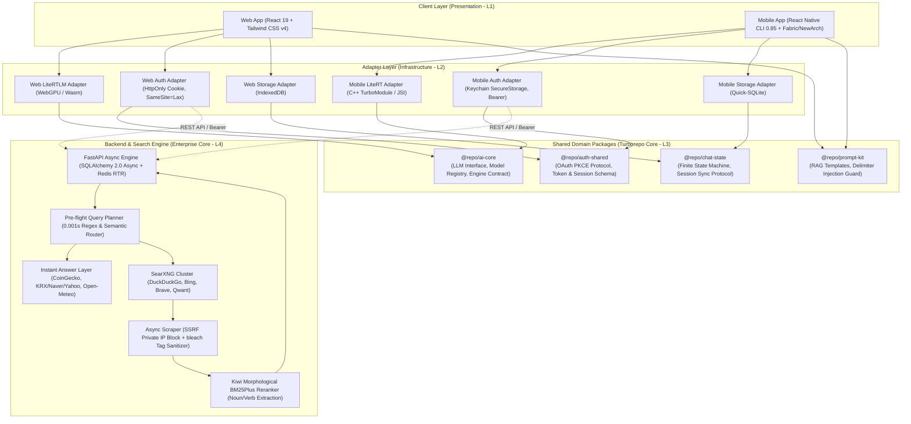
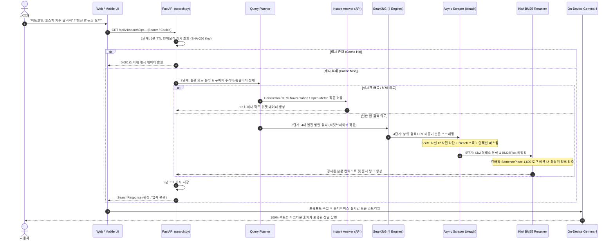

# 🌐 Gemma4-Omni: Local-First Cross-Platform On-Device AI Ecosystem

<div align="center">


**프라이버시를 완벽히 보호하는 온디바이스(On-Device) AI 분산 추론과 SearXNG 기반 5단계 하이브리드 RAG 파이프라인을 결합한 엔터프라이즈급 멀티플랫폼(Web & Mobile) AI 생태계**

[소개](#-1-프로젝트-개요-및-아키텍처-철학) •
[시스템 아키텍처](#-2-시스템-아키텍처) •
[핵심 설계 결정 (ADR)](#-3-핵심-아키텍처-결정-기록-adr-summary) •
[5단계 RAG 파이프라인](#-4-searxng-기반-5단계-고도화-웹-검색-rag-파이프라인) •
[트러블슈팅](#-5-심층-트러블슈팅-및-기술적-난제-해결) •
[품질 검증 지표](#-6-품질-검증-지표-quality-assurance) •
[시작하기](#-7-시작하기-getting-started) •
[면접 대비 문서](INTERVIEW_PREP.md)

</div>

---

## 💡 1. 프로젝트 개요 및 아키텍처 철학

`gemma4-omni`는 중앙 클라우드 API(OpenAI, Anthropic 등)에 의존하여 발생하는 **기하급수적인 서버 추론 비용**, **네트워크 지연 시간 변동성**, **사용자 프롬프트 및 개인정보 유출 리스크**를 근본적으로 해결하기 위해 설계된 **Local-First On-Device AI 생태계**입니다.

사용자의 기기(Web 브라우저의 WebGPU, 스마트폰의 NPU/GPU)에서 Google의 최신 경량화 파운데이션 모델인 **Gemma 4 (2B / 4B)**를 100% 독립 구동하며, 로컬 우선 스토리지(IndexedDB / SQLite)와 자체 구축한 FastAPI 백엔드를 연계하여 **"Zero Commercial AI Leakage & Cross-Device Sync"**를 완성했습니다.

### 🌟 4대 핵심 아키텍처 원칙
1. **100% 클라이언트 온디바이스 추론 (Zero Cloud Inference Cost & Zero Leakage)**:
   - 사용자의 질문, 첨부 이미지, 대화 컨텍스트가 외부 상용 AI 서버로 절대 전송되지 않고 기기 내부 VRAM/메모리에서 완결됩니다.
2. **로컬 퍼스트 & 안전한 클라우드 동기화 (Local-First, Resilient Sync)**:
   - 비로그인(게스트) 상태에서도 100% 로컬 스토리지에 암호화 저장되어 완벽한 오프라인 작동을 보장하며, 소셜 로그인 시 디바이스 간 대화 세션을 충돌 없이 동기화합니다.
3. **단일 도메인 코어 & 클린 어댑터 분리 (DIP 기반 모노레포)**:
   - 비즈니스 로직(`@repo/chat-state`), 프롬프트 템플릿(`@repo/prompt-kit`), LLM 인터페이스(`@repo/ai-core`), 인증 규격(`@repo/auth-shared`)을 순수 TypeScript로 캡슐화하고 플랫폼 런타임 종속성을 어댑터 계층으로 철저히 격리했습니다.
4. **결정론적 5단계 하이브리드 RAG 파이프라인**:
   - 4B급 소형 온디바이스 모델의 최신 팩트 부족 및 환각(Hallucination)을 극복하기 위해, **사전 쿼리 플래너(Query Planner) ➔ 인스턴트 금융/날씨 위젯 ➔ SearXNG 멀티엔진 검색 ➔ Kiwi 형태소 BM25Plus 리랭킹 ➔ 런타임 SentencePiece 1,600 토큰 엄격 예산 압축**으로 이어지는 고성능 RAG 체계를 갖추었습니다.

---

## 🏛️ 2. 시스템 아키텍처

클린 아키텍처의 의존성 역전 원칙(DIP)과 어댑터 패턴(Adapter Pattern)을 적용하여, UI 레이어와 플랫폼별 네이티브 런타임 엔진이 공유 도메인 인터페이스에 의존하도록 설계했습니다.



---

## 📦 3. 핵심 아키텍처 결정 기록 (ADR Summary)

### [ADR-01] 왜 Expo 대신 `react-native-cli` + C++ Turbo Modules(JSI)인가?
* **배경**: 온디바이스 AI 추론 엔진인 `google-ai-edge/LiteRT-LM`은 최신 C++ 바이너리와 OpenCL/Vulkan GPU 하드웨어 가속 라이브러리에 직접 바인딩되어야 합니다.
* **비교 분석**:
  * *Option A (Expo / EAS)*: 설정이 간편하나 커스텀 C++ NDK 빌드, CMakeLists, 로컬 JSI 엔진 컴파일 시 네이티브 링커 제약이 발생하며, 프레임워크 추상화 레이어로 인한 오버헤드가 존재함.
  * *Option B (React Native CLI + New Architecture)*: Fabric 및 TurboModule을 직접 제어할 수 있어 JavaScript-Native 브릿지 직렬화 비용(JSON Serialization) 없이 메모리 포인터 레벨에서 텍스트 스트리밍과 토큰 콜백을 다이렉트로 처리(JSI)할 수 있음.
* **결정**: 고성능 온디바이스 NPU/GPU 가속과 무결한 C++ 생명주기 관리를 위해 **`react-native-cli` 기반의 순수 TurboModule 아키텍처**를 채택했습니다.

### [ADR-02] 왜 중앙 클라우드 추론 대신 디바이스 분산 추론(WebGPU / LiteRT-LM)인가?
* **배경**: SaaS AI 챗봇 서비스의 가장 큰 난제는 유저 수 증가에 비례하여 기하급수적으로 폭증하는 클라우드 GPU 비용과, 개인 대화 내용의 서버 유출 우려입니다.
* **비교 분석**:
  * *Option A (중앙 클라우드 vLLM / OpenAI API)*: 클라이언트 구현은 단순하지만 매 쿼리마다 토큰당 비용 발생, 피크 트래픽 시 서버 확장(Auto-scaling) 한계 및 프라이버시 법적 이슈(GDPR/HIPAA 등) 상존.
  * *Option B (클라이언트 온디바이스 WebGPU / LiteRT-LM)*: 4B급 파운데이션 모델을 클라이언트 하드웨어에서 분산 추론하므로 인프라 추론 비용이 **0원($0)**으로 수렴하며, 완전한 오프라인 동작과 100% 프라이버시가 보장됨.
* **결정**: 메모리 거버넌스(단일 모델 점유 원칙, 안전 마진 검사, 초기화 뮤텍스)를 엄격히 구축하여 클라이언트 OOM을 원천 차단하고 **온디바이스 분산 추론**을 구현했습니다.

### [ADR-03] 왜 Web과 Mobile의 인증 스토리지를 분리하고 Adapter 패턴을 적용했는가?
* **배경**: 웹 브라우저와 모바일 네이티브 앱은 공격 표면(Attack Surface)과 보안 런타임이 근본적으로 다릅니다.
* **비교 분석**:
  * *Web*: JavaScript 실행 환경 특성상 LocalStorage에 토큰을 저장하면 XSS(Cross-Site Scripting) 공격 한 번으로 탈취됨 ➔ **`HttpOnly; SameSite=Lax; Secure` 쿠키**가 필수적.
  * *Mobile*: WebView/CustomTab 기반 쿠키는 OS 라이프사이클에 따라 유실되기 쉽고 불안정함 ➔ OS 하드웨어 암호화 영역인 **iOS Keychain / Android EncryptedSharedPreferences** 기반의 Bearer 토큰이 필수적.
* **결정**: 단일 인터페이스 `AuthAdapter`를 정의하고 `WebAuthAdapter`(쿠키 자동 전송)와 `MobileAuthAdapter`(키체인 Bearer 주입)로 분리 구현하여 플랫폼별 보안 강도를 극대화했습니다.

### [ADR-04] 왜 실시간 데이터 주입에 툴 콜링(Tool Calling) 대신 사전 쿼리 플래너(Query Planner)를 택했는가?
* **배경**: 4B급 소형 모델에서 툴 콜링(Function Calling)은 2회 이상의 추론 턴이 소요되며, JSON 포맷팅 실패 및 도구 호출 누락(환각)이 빈번합니다.
* **비교 분석**:
  * *Option A (In-flight Tool Calling)*: 모델이 도구 스키마를 읽고 JSON을 생성한 뒤 서버 결과를 받아 다시 추론 ➔ 2-Turn 소요로 모바일 체감 지연(TTFT) 2배 증가, 소형 모델의 JSON 문법 파싱 에러율 15% 이상.
  * *Option B (Pre-flight Query Planner)*: 백엔드가 0.001초 만에 질의 의도(날씨, 환율, 암호화폐, 증시, 웹 검색)를 분류하고 즉답 위젯 또는 검색 컨텍스트를 사전에 조립하여 모델에 단 1회 주입 ➔ **1-Turn 추론으로 즉답 완성**.
* **결정**: 초저지연과 100% 결정론적 팩트 전달을 위해 **사전 쿼리 플래너(Pre-flight Query Planner)**를 채택했습니다.

---

## ⚡ 4. SearXNG 기반 5단계 고도화 웹 검색 RAG 파이프라인

프라이버시 중심의 멀티 검색엔진 **SearXNG(DuckDuckGo, Bing, Brave, Qwant)**를 기반으로 구축된 5단계 실시간 파이프라인입니다.



### 🔬 RAG 핵심 컴포넌트 명세
* **Query Planner ([`query_planner.py`](apps/auth-server/app/services/search/query_planner.py))**: 구어체 종결어미(`"알려줘"`, `"어때"`) 및 수식어(`"주요 헤드라인 3가지만"`)를 0.001초 만에 스마트 정제하여 검색 리콜을 극대화.
* **Instant Answer ([`instant_answers.py`](apps/auth-server/app/services/search/instant_answers.py))**: CoinGecko(비트코인/알트코인), 한국거래소/Naver/Yahoo Finance(코스피/나스닥), Open-Meteo(기상청), Frankfurter(환율) 직통 API 위젯 생성.
* **Async Scraper ([`scraper.py`](apps/auth-server/app/services/search/scraper.py))**: 사설망 침투(SSRF) 방지를 위해 `127.0.0.0/8`, `10.0.0.0/8`, `192.168.0.0/16` 등을 DNS 검증으로 차단하고, `bleach`로 악성 태그 박멸 및 프롬프트 인젝션 패턴 마스킹.
* **Kiwi BM25Plus Reranker ([`reranker.py`](apps/auth-server/app/services/search/reranker.py))**: 한국어 형태소 분석기(Kiwi)로 의미 있는 실질 형태소(명사/동사/형용사)만 추출하여 노이즈를 제거한 뒤, BM25Plus 알고리즘으로 채점하여 **Gemma SentencePiece 기준 1,600 토큰 이내로 본문 압축**.
* **3-State 서킷 브레이커 ([`cache.py`](apps/auth-server/app/services/search/cache.py))**: 외부 검색 엔진의 일시적 CAPTCHA 차단 시 해당 엔진을 격리(`CLOSED` ➔ `OPEN` ➔ `HALF_OPEN`)하여 전체 파이프라인 무중단 유지.

---

## 🛠️ 5. 심층 트러블슈팅 및 기술적 난제 해결

### 1) WebAssembly / WebGPU 동시 초기화 충돌 및 C++ 메모리 오염 방어
* **현상**: 모델 로드 중 사용자가 모델을 빠르게 연속 변경하거나 더블 클릭할 때, `litertlm_wasm_internal.wasm` 내부에 2개의 `Engine.create()`가 동시 진입하여 `RuntimeError: null function` 및 `divide by zero`가 발생하고 브라우저 탭 붕괴.
* **원인**: C++ 싱글톤 글로벌 힙 상태가 덮어씌워지며 메모리 포인터 레이스 컨디션 발생.
* **해결**: `LiteRTLMAdapter`에 비동기 뮤텍스 락(`isInitializing`)을 구축하고, UI 계층에서 `chatPhase === 'model-loading'` 진입 시 로드 트리거를 원천 차단하여 동시성 레이스 컨디션을 완벽히 해결.

### 2) 온디바이스 토크나이저 바이너리 비트 단위 무결성 검증
* **현상**: 서버에서 RAG 컨텍스트를 압축할 때 사용하는 토크나이저와 클라이언트(WebGPU/Mobile)에서 구동되는 실제 Gemma 4 모델의 토크나이저가 불일치할 경우 토큰 예산 초과로 인한 온디바이스 OOM 발생 가능성 존재.
* **해결**: `.litertlm` 바이너리 FlatBuffer의 `section_metadata`를 런타임에 파싱하여 내장된 `SP_Tokenizer` 모델 바이너리(4,688,993 bytes)를 추출. 모바일 번들과 웹 번들의 토크나이저 SHA256 체크섬을 검증하여 **`1704c7aee...`로 비트 단위 100% 일치(어휘 크기 `262,144`)**함을 증명하고 백엔드 자산으로 동기화.

### 3) React Native C++ 런타임 크래시(SIGSEGV) 방지 — Soft Stop & Deferred Interrupt
* **현상**: 모바일 앱에서 온디바이스 추론 스트리밍 중 사용자가 '정지(Stop)'를 누르면 간헐적으로 네이티브 레이어에서 `SIGSEGV` 치명적 크래시 발생.
* **원인**: LiteRT-LM C++ 엔진의 Prefill(프롬프트 인코딩) 구간 도중 인터럽트를 시도하면 내부 KV-Cache 텐서가 해제되어 널 포인터 참조 발생.
* **해결**:
  * **Deferred Interrupt**: 첫 토큰(TTFT)이 생성된 이후인 Decode 구간에 도달했을 때만 실제 네이티브 중단을 트리거.
  * **Soft Stop**: 중단 직후 네이티브가 메모리를 안전하게 정리하고 `onGenerationSettled` 이벤트를 발행할 때까지 입력을 잠그는 `isSettling` 상태 가드 구축.

### 4) 크로스 플랫폼 OAuth 리다이렉트 불일치 및 보안 규정(RFC 8252) 정규화
* **현상**: Vercel Preview 서브도메인 및 모바일 실기기(HTTP IP)에서 Google OAuth 실행 시 `400: redirect_uri_mismatch` 및 `400: invalid_request` 차단 발생.
* **원인**: Google의 엄격한 보안 규정에 의해 일반 HTTP IP(`http://161.33.7.206:8000`) 및 비인가 프리뷰 도메인이 리다이렉트 URI로 불허됨.
* **해결**: 모든 클라이언트 요청의 리다이렉트 URI를 Google Cloud Console에 등록된 단일 공인 HTTPS URI(`https://gemma4-omni-web.vercel.app/auth/callback`)로 강제 정규화하고, 콜백 수신 즉시 모바일 딥링크(`com.mobile://oauth/callback`)로 토스하는 브릿지 핸들러 구현.

---

## 🧪 6. 품질 검증 지표 (Quality Assurance)

```text
============================= Test Summary =============================
Backend Pytest Suite (100% Async Non-blocking):
  tests/api/test_auth.py ......................... PASSED [ 13%]
  tests/api/test_chats.py ........................ PASSED [ 17%]
  tests/api/test_search.py ....................... PASSED [ 37%]
  tests/test_instant_answers.py .................. PASSED [ 44%]
  tests/test_query_planner.py .................... PASSED [ 55%]
  tests/test_reranker.py ......................... PASSED [ 65%]
  tests/test_scraper.py .......................... PASSED [ 72%]
  tests/test_search_pipeline.py .................. PASSED [ 86%]
  tests/test_session_rotation.py ................. PASSED [ 93%]
  tests/test_social_auth.py ...................... PASSED [100%]
  ================== 29 passed in 5.15s (100% Success) ==================

Frontend Vitest Suite:
  src/__tests__/LiteRTLMAdapter.test.ts .......... PASSED
  src/__tests__/ChatBubble.test.tsx .............. PASSED
  ================== 7 passed in 0.73s (100% Success) ===================

TypeScript Static Type Analysis:
  pnpm --filter @repo/* build .................... 0 Errors
  pnpm --filter web exec tsc --noEmit ............ 0 Errors
  pnpm --filter mobile exec tsc --noEmit ......... 0 Errors

Production Bundle Artifacts:
  Web (Vite Rolldown Minified) ................... Gzip 369.63 kB
  Android App Bundle (Hermes Bytecode AAB) ....... 48.0 MB
  iOS App (Xcode Release Target, arm64) .......... Build Succeeded
========================================================================
```

---

## 🚀 7. 시작하기 (Getting Started)

### 1) 사전 요구사항
* Node.js >= 22.11.0
* pnpm >= 9.0.0
* Python >= 3.11
* Docker & Docker Compose
* Xcode 16+ (iOS 빌드 시) / Android Studio & JDK 17 (Android 빌드 시)

### 2) 모노레포 클론 및 의존성 설치
```bash
git clone https://github.com/ijs1103/gemma4-omni.git
cd gemma4-omni
pnpm install
```

### 3) 백엔드 및 SearXNG 실행
```bash
# SearXNG 컨테이너 구동
docker run -d --name searxng -p 8080:8080 \
  -v $(pwd)/apps/auth-server/searxng-settings.yml:/etc/searxng/settings.yml:ro \
  searxng/searxng:latest

# FastAPI 백엔드 구동
cd apps/auth-server
python -m venv .venv
source .venv/bin/activate
pip install -r requirements.txt
uvicorn app.main:app --reload --port 8000
```

### 4) 클라이언트 실행
```bash
# Web 클라이언트 실행 (WebGPU 지원 브라우저)
pnpm --filter web dev

# Mobile Android 실기기/에뮬레이터 실행
pnpm --filter mobile android

# Mobile iOS 시뮬레이터 실행
pnpm --filter mobile ios
```

---

## 📄 License
This project is licensed under the Apache License 2.0 - see the [LICENSE](LICENSE) file for details.
