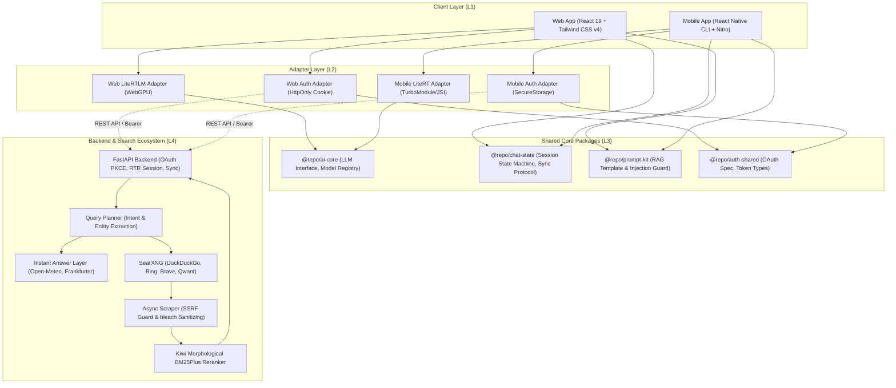
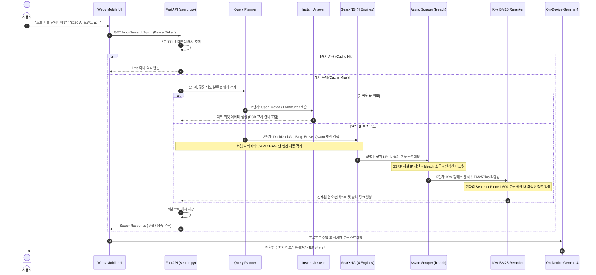

# 🌐 Gemma4-Omni: Local-First Cross-Platform On-Device AI Ecosystem

<div align="center">


**프라이버시를 완벽히 보호하는 온디바이스(On-Device) AI 추론과 SearXNG 기반 5단계 고도화 웹 검색 RAG 파이프라인을 결합한 멀티플랫폼(Web & Mobile) AI 챗봇 생태계**

[소개](#-1-프로젝트-개요-및-핵심-철학) •
[시스템 아키텍처](#-2-시스템-아키텍처) •
[핵심 기능](#-3-모노레포-구조-및-패키지-책임) •
[5단계 RAG 파이프라인](#-4-searxng-기반-5단계-고도화-웹-검색-rag-파이프라인) •
[트러블슈팅](#-5-기술적-도전-및-트러블슈팅) •
[시작하기](#-7-시작하기-getting-started) •
[성장 스토리](#-8-developer-story--vibe-coding)

</div>

---

## 💡 1. 프로젝트 개요 및 핵심 철학

`gemma4-omni`는 외부 상용 AI 클라우드(OpenAI, Anthropic 등)로의 프롬프트 전송 없이 **기기 내부(WebGPU / NPU)에서 100% 온디바이스 AI 추론을 수행**하며, 로컬 저장소(IndexedDB / SQLite) 기반의 오프라인 동작과 소셜 로그인을 통한 **자체 FastAPI 백엔드 크로스 디바이스 동기화(Local-First, Cloud-Sync)**를 결합한 하이브리드 AI 챗봇 플랫폼입니다.

단일 도메인 패키지 아키텍처를 기반으로 **Web(WebGPU / WebLLM)**과 **Mobile(React Native + LiteRT-LM Native TurboModule)**을 하나의 Turborepo 모노레포로 통합하였으며, 로컬 LLM(Gemma 4)의 지식 한계를 극복하기 위해 **SearXNG 기반의 단순 스니펫 검색을 넘어 [의도 분류 ➔ 인스턴트 위젯 ➔ 비동기 스크래핑 ➔ Kiwi 형태소 BM25 리랭킹 ➔ 온디바이스 Gemma SP 토큰 압축 + 5분 TTL 캐시]로 이어지는 5단계 고도화 RAG 파이프라인**을 자체 구축하여 실시간 팩트 기반의 고품질 답변을 제공합니다.

### 🌟 핵심 가치
1. **100% 온디바이스 AI 추론 (Zero Commercial AI Leakage)**: 상용 AI API를 거치지 않고 사용자 기기(WebGPU / NPU / GPU)에서 직접 모델이 구동되어 사용자가 작성한 프롬프트이 외부 서버로 유출되지 않습니다.
2. **로컬 우선 & 클라우드 동기화 (Local-First, Cloud-Sync)**: 비로그인 시 로컬 디바이스(IndexedDB / SQLite)에만 데이터가 보관되며, 소셜 로그인 시 자체 구축한 FastAPI 백엔드를 통해 Web ↔ Mobile 간 안전한 암호화 동기화를 제공합니다.
3. **단일 도메인 멀티플랫폼 (Cross-Platform Architecture)**: 비즈니스 로직, 상태 머신, 프롬프트 템플릿을 공유 패키지(`packages/*`)로 모듈화하여 웹과 앱의 일관된 사용자 경험을 보장합니다.
4. **지능형 하이브리드 RAG (5-Stage Search Pipeline)**: 날씨/환율 직통 즉답 위젯, 4대 엔진 병렬 탐색, SSRF/소독 가드, 한국어 형태소(Kiwi) BM25 리랭킹, 온디바이스 토큰 예산 관리를 통해 오차 없는 실시간 정보를 제공합니다.

---

## 🏛️ 2. 시스템 아키텍처

클린 아키텍처의 의존성 역전 원칙(DIP)과 어댑터 패턴(Adapter Pattern)을 적용하여, UI 레이어와 플랫폼별 런타임 엔진이 공통 인터페이스에 의존하도록 설계했습니다.



---

## 📦 3. 모노레포 구조 및 패키지

```text
gemma4-omni/
├── apps/
│   ├── web/               # React 19 + Vite + WebGPU 기반 온디바이스 웹 챗봇
│   ├── mobile/            # React Native (CLI) + TurboModules 온디바이스 앱
│   └── auth-server/       # FastAPI + SQLAlchemy 2.0 Async + Redis + RAG 백엔드
├── packages/
│   ├── ai-core/           # 온디바이스 LLM Adapter 인터페이스 및 모델 레지스트리
│   ├── chat-state/        # XState 기반 채팅 세션 상태 머신 및 클라우드 동기화 규격
│   ├── prompt-kit/        # RAG 위젯/컨텍스트 주입 템플릿 및 프롬프트 인젝션 가드
│   ├── auth-shared/       # OAuth2 PKCE 규격, 세션 및 사용자 타입 정의
│   ├── tool-schema/       # 온디바이스 Function Calling 도구 스키마 정의
│   ├── markdown/          # Shiki & KaTeX 수식/코드 하이라이팅 파서
│   └── ui-tokens/         # 웹/모바일 공통 테마 토큰 (Color, Spacing, Typography)
└── searxng-settings.yml   # 4대 프라이버시 검색엔진 구성 파일
```

---

## ⚡ 4. SearXNG 기반 5단계 고도화 웹 검색 RAG 파이프라인

기존의 단순 검색 스니펫만 나열하던 1차원적 RAG의 한계를 극복하기 위해, 프라이버시 중심의 멀티 검색엔진 **SearXNG(DuckDuckGo, Bing, Brave, Qwant)**를 기반으로 **[의도 분류(Query Planner) ➔ 인스턴트 위젯(Instant Answer) ➔ 비동기 스크래퍼(Scraper) ➔ Kiwi 형태소 기반 BM25Plus 리랭킹(Reranker) ➔ 온디바이스 Gemma SentencePiece 토큰 예산 압축 컨텍스트 조립]**의 5단계 고도화 파이프라인과 **5분 TTL 캐시**를 구축했습니다.



### 🔬 RAG 핵심 컴포넌트 구현 명세
- **Query Planner ([`query_planner.py`](apps/auth-server/app/services/search/query_planner.py))**: 질의 의도(`instant_weather`, `instant_currency`, `web_search`)를 분류하고 종결어미(`어때`, `알려줘`, `얼마니` 등)를 제거하여 검색 리콜을 극대화합니다.
- **Instant Answer ([`instant_answers.py`](apps/auth-server/app/services/search/instant_answers.py))**: Open-Meteo 기상청 직통 API 및 Frankfurter 환율 API(유럽중앙은행 ECB 1일 1회 고시 제약 안내 포함)로 지연 시간 없는 즉답을 생성합니다.
- **Async Scraper ([`scraper.py`](apps/auth-server/app/services/search/scraper.py))**: 내부망 침투(SSRF)를 방어하기 위해 사설 IP 대역(`127.0.0.0/8`, `10.0.0.0/8`, `192.168.0.0/16` 등)을 사전 DNS 검증으로 차단하며, `bleach`로 악성 태그를 박멸하고 프롬프트 인젝션 패턴을 마스킹합니다.
- **Kiwi BM25 Reranker ([`reranker.py`](apps/auth-server/app/services/search/reranker.py))**: 한국어 형태소 분석기(Kiwi)로 명사(`NNG/NNP`) 및 원형 복원된 동사/형용사(`VV/VA`)만 추출하여 조사를 제거한 뒤, `BM25Plus` 점수를 매겨 **온디바이스 Gemma SentencePiece 토크나이저(어휘 사전 262,144개) 기준 정확히 1,600 토큰 상한 내로 압축**합니다.
- **Resilience ([`cache.py`](apps/auth-server/app/services/search/cache.py))**: 5분 TTL 인메모리 캐시 및 외부 엔진 장애 전파를 방지하는 3-State 서킷 브레이커(`CLOSED` ➔ `OPEN` ➔ `HALF_OPEN`)를 구축했습니다.

---

## 🛠️ 5. 기술적 도전 및 트러블슈팅

### 1) WebAssembly / WebGPU 동시 초기화 충돌 및 런타임 에러 방어
- **문제**: 모델 로딩(약 30~70초 소요) 중 사용자가 버튼을 다중 클릭하거나 모델을 빠르게 전환할 때, `litertlm_wasm_internal.wasm` 모듈 내부에 2개의 `Engine.create()`가 동시 진입하여 C++ 글로벌 상태가 덮어씌워지고 `RuntimeError: null function` 및 `RuntimeError: divide by zero`가 발생하며 WASM 힙이 오염됨.
- **해결**: 
  - `LiteRTLMAdapter`에 `isInitializing` 뮤텍스 락을 적용하여 이전 초기화가 진행 중일 때 들어오는 호출을 원천 차단.
  - UI 레이어(`ModelGalleryModal.tsx`, `App.tsx`)에서 로딩 단계(`chatPhase === 'model-loading'`)에 진입하면 로드 버튼을 `disabled` 및 "로딩 중..." 상태로 전환하여 동시성 레이스 컨디션을 해결.

### 2) 온디바이스 토크나이저 바이너리 비트 단위 무결성 검증
- **문제**: 서버에서 RAG 컨텍스트를 압축할 때 사용하는 토크나이저와 클라이언트(WebGPU/Mobile)에서 구동되는 실제 Gemma 4 모델의 토크나이저가 불일치할 경우 토큰 예산 초과로 인한 온디바이스 OOM 발생 가능성 존재.
- **해결**:
  - `google-ai-edge/LiteRT-LM` 번들(`.litertlm`)의 FlatBuffer `section_metadata`를 런타임에 동적으로 파싱하여 내장된 `SP_Tokenizer` 모델 바이너리(4,688,993 bytes)를 추출.
  - 프로덕션 모바일 번들(`gemma-4-e4b-it.litertlm`)과 웹 번들(`gemma-4-E4B-it-web.litertlm`)의 토크나이저를 SHA256 체크섬으로 비교 검증하여 **`1704c7aee...`로 비트 단위 100% 일치(어휘 크기 `262,144`)**함을 증명하고 백엔드 자산으로 동기화.

### 3) 크로스 플랫폼 보안 인증 아키텍처 격리
- **문제**: 웹 환경은 XSS 방어를 위해 `HttpOnly SameSite=Lax` 쿠키가 필수적이나, 모바일 환경은 쿠키 저장이 불안정하여 OS 수준의 `SecureStorage` 키체인 기반 Bearer 토큰이 요구됨.
- **해결**:
  - `AuthAdapter` 인터페이스를 정의하고, `WebAuthAdapter`(withCredentials 쿠키 자동 전송)와 `MobileAuthAdapter`(SecureStorage + Authorization 헤더 주입)로 분리.
  - 백엔드에 Refresh Token Rotation(RTR)과 탈취 감지(Token Reuse Detection) 메커니즘을 구현하여 비정상적인 토큰 재사용 시 모든 연결 세션을 즉시 강제 만료 처리.

---

## 🧪 6. 검증 및 테스트 성과

```text
============================= Test Summary =============================
Backend Pytest Suite:
  tests/api/test_auth.py ......................... PASSED [ 13%]
  tests/api/test_chats.py ........................ PASSED [ 17%]
  tests/api/test_search.py ....................... PASSED [ 37%]
  tests/test_instant_answers.py .................. PASSED [ 44%]
  tests/test_query_planner.py .................... PASSED [ 55%]
  tests/test_reranker.py ......................... PASSED [ 65%]
  tests/test_scraper.py .......................... PASSED [ 72%]
  tests/test_search_pipeline.py .................. PASSED [ 86%]
  tests/test_session_rotation.py ................. PASSED [ 93%]
  tests/test_social_auth.py ...................... PASSED [100%]
  ================== 29 passed in 5.03s (100% Success) ==================

Frontend Vitest Suite:
  src/__tests__/LiteRTLMAdapter.test.ts .......... PASSED
  src/__tests__/ChatBubble.test.tsx .............. PASSED
  ================== 7 passed in 0.73s (100% Success) ===================

TypeScript Static Analysis:
  pnpm --filter @repo/* build .................... 0 Errors
  pnpm --filter web exec tsc --noEmit ............ 0 Errors
  pnpm --filter mobile exec tsc --noEmit ......... 0 Errors
========================================================================
```

---

## 🚀 7. 시작하기 (Getting Started)

### 1) 사전 요구사항
- Node.js >= 20.0.0
- pnpm >= 9.0.0
- Python >= 3.11
- Docker & Docker Compose (SearXNG 구동용)

### 2) 저장소 클론 및 패키지 설치
```bash
git clone https://github.com/ijs1103/gemma4-omni.git
cd gemma4-omni
pnpm install
```

### 3) SearXNG 검색 엔진 컨테이너 실행
```bash
docker run -d --name searxng -p 8080:8080 \
  -v $(pwd)/apps/auth-server/searxng-settings.yml:/etc/searxng/settings.yml:ro \
  searxng/searxng:latest
```

### 4) 백엔드 서버 구동
```bash
cd apps/auth-server
python -m venv .venv
source .venv/bin/activate
pip install -r requirements.txt
uvicorn app.main:app --reload --port 8000
```

### 5) 웹 클라이언트 실행 (WebGPU 지원 브라우저)
```bash
pnpm --filter web dev
# 브라우저에서 http://localhost:5173 접속
```

---

## 👨‍💻 8. Developer Story & Vibe Coding

> **"AI-Native 페어 프로그래밍으로 온디바이스 AI 풀스택 엔지니어링에 도전하다."**

기존의 전형적인 UI 개발 영역에 안주하지 않고, **최신 AI 어시스턴트(Cursor, Claude, Gemini)와의 유기적인 '바이브 코딩(Vibe Coding)'**을 통해 시스템의 복잡도를 빠르게 학습하고 제어 범위를 확장했습니다.

- **기획 및 아키텍처 수립**: 단순한 API 호출 챗봇을 넘어, 온디바이스 WebGPU/LiteRT-LM 엔진을 분석하고 모노레포 기반의 클린 아키텍처를 주도적으로 설계했습니다.
- **RAG 파이프라인 엔지니어링**: SearXNG 기반의 단순 스니펫 검색의 한계를 개선하여, Python FastAPI 백엔드에 의도 분류(Query Planner), 인스턴트 위젯(Instant Answer), 비동기 스크래퍼(Scraper), Kiwi 형태소 BM25Plus 리랭킹(Reranker), Gemma SP 토큰 예산 관리 및 5분 TTL 캐시를 갖춘 **5단계 고도화 RAG 파이프라인**을 직접 설계하고 구현했습니다.
- **엔지니어링 완성도**: AI가 제안하는 코드에 의존하는 것을 넘어, C++ WASM 충돌 디버깅, 토크나이저 바이너리 비트 검증, 29개 Pytest 전수 검증 등 **프로덕션 수준의 기술적 신뢰성과 무결성**을 직접 검증하며 완성했습니다.

AI를 파트너 삼아 한계를 두지 않고 풀스택 생태계를 완벽하게 완성해 낸 이 경험은, 앞으로 어떠한 고난도의 기술 스택도 빠르게 흡수하고 비즈니스 가치로 전환할 수 있다는 저의 가장 큰 무기입니다.

---

## 📄 License
This project is licensed under the Apache License 2.0 - see the [LICENSE](LICENSE) file for details.
