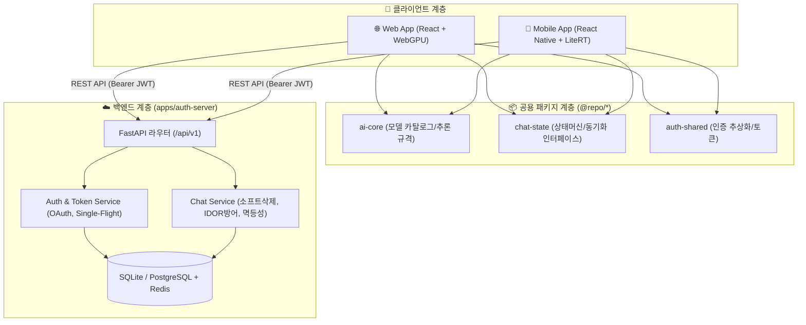

# 옾피티 (Gemma4-Omni)

> **로컬 우선(Local-First) 온디바이스 AI 추론 & 크로스 디바이스(Web ↔ Mobile) 클라우드 동기화 채팅 플랫폼**


---

## 📌 1. 프로젝트 개요 (Overview)

**옾피티(Gemma4-Omni)**는 사용자 기기의 연산 자원(WebGPU / NPU / GPU)을 활용하여 서버 비용과 데이터 유출 걱정 없이 기기 자체에서 구동되는 **온디바이스(On-Device) 로컬 AI 채팅 서비스**입니다.

동시에 소셜 로그인(Google, Apple, Kakao, Naver)을 통해 **웹 브라우저와 모바일 앱(iOS/Android) 간의 대화 기록이 실시간으로 안전하게 동기화**되는 하이브리드 로컬 우선(Local-First) 아키텍처를 구현했습니다.

### ✨ 핵심 가치
- 🔒 **100% 프라이버시 보호**: 대화 추론이 기기 내부에서 이루어져 사용자의 민감한 대화 내용이 AI 제공사 서버로 전달되지 않습니다.
- ⚡ **오프라인 우선 (Local-First)**: 인터넷이 끊기거나 서버가 다운되어도 온디바이스 AI를 통한 대화가 정상 작동하며, 네트워크 복구 시 자동으로 클라우드에 백업됩니다.
- 🔄 **완벽한 크로스 디바이스 동기화**: 웹에서 시작한 대화를 모바일에서 이어서 진행할 수 있으며, 삭제/수정/신규 대화가 모든 기기에서 즉시 일치합니다.
- 🛡️ **엔터프라이즈급 보안**: Token Rotation 동시성 제어, IDOR 침범 방지, 소프트 삭제(Soft Delete) 및 멱등성(Idempotency)이 보장됩니다.

---

## 🏗️ 2. 시스템 아키텍처 (Architecture)

본 프로젝트는 **Turborepo**와 **pnpm Workspace** 기반의 모노레포로 구성되어 있습니다.

```
gemma4-omni/
├── apps/
│   ├── auth-server/       # FastAPI 기반 OAuth 인증 및 채팅 동기화 REST 백엔드
│   ├── web/               # React 19 + Vite + WebGPU 기반 웹 애플리케이션
│   └── mobile/            # React Native (iOS/Android) + LiteRT-LM 네이티브 앱
│
├── packages/
│   ├── ai-core/           # 공통 LLM 인터페이스, 모델 스펙, 스트리밍 타입
│   ├── auth-shared/       # 플랫폼 공통 OAuth 어댑터 인터페이스 및 세션 모델
│   ├── chat-state/        # 로컬 상태머신, StorageAdapter, RemoteChatClient
│   ├── prompt-kit/        # 시스템 프롬프트 및 대화 템플릿 빌더
│   └── ui-tokens/         # 공통 테마, 색상 팔레트 및 UI 토큰
│
├── package.json           # 루트 모노레포 설정
├── turbo.json             # Turborepo 빌드 파이프라인
└── pnpm-workspace.yaml    # 워크스페이스 패키지 정의
```

### 🏛️ 서비스 계층 다이어그램



---

## 🚀 3. 주요 구현 기능 상세

### 1) 온디바이스 AI 추론 엔진 (On-Device Inference)
- **Web App (`apps/web`)**:
  - WebGPU 및 WebLLM / LiteRT-LM Web 런타임 탑재
  - 멀티 토큰 스트리밍, TTFT(첫 토큰 생성 시간) 및 초당 토큰 수(Tokens/sec) 실시간 벤치마크
  - 추론 중단(Interrupt) 및 재생성 지원
- **Mobile App (`apps/mobile`)**:
  - Google LiteRT-LM C++ / Native Engine을 JSI/Native Module 브릿지로 직접 바인딩
  - **다중 모델 갤러리 (Multi-Model Gallery)**: Gemma 4 E2B, Gemma 4 E4B 모델별 용량 검사, 백그라운드 다운로드 및 상태 관리
  - 소프트 스탑(Soft Stop): 네이티브 백그라운드 정리 상태(`isSettling`) 감지로 비정상 크래시 원천 방지

### 2) 소셜 로그인 & 토큰 관리 시스템
- **4대 소셜 로그인 지원**: Google, Apple, Kakao, Naver
- **웹**: 백엔드 PKCE 인가 코드 교환 + 팝업 postMessage 브릿지 + HttpOnly Refresh Token
- **모바일**: InAppBrowser / Native SDK + Keychain/Keystore 보안 저장소
- **단일 비행(Single-Flight) 토큰 회전 락**:
  - 앱 시작 시 여러 컴포넌트가 동시에 토큰 갱신을 요청해도 `refreshPromise`를 공유하여 단 1회만 서버 요청
  - Token Reuse Detection(토큰 재사용 오탐지)으로 인한 세션 강제 폐기(Revoke) 방지

### 3) 크로스 디바이스 클라우드 채팅 동기화 (Cloud Chat Sync)
- **오프라인 펜딩 큐 (`retryPendingSync`)**:
  - 오프라인/서버 다운 시 `sessionSyncStatus: 'pending'`, `syncStatus: 'pending'`으로 로컬 저장
  - 브라우저 창 포커스(`focus`, `visibilitychange`) 및 모바일 포그라운드 복귀(`AppState`) 시 자동 서버 전송
- **안전한 REST API & 멱등성 (Idempotency)**:
  - 동일 메시지 재전송 시 500 에러 없이 기존 메시지를 반환하여 중복 생성 방어
- **보안 방어 (IDOR Prevention)**:
  - 메시지 추가 시 세션 소유권과 소속 세션 ID를 엄격히 검증하여 타 사용자 메시지 침범 차단 (`409 Conflict`)
- **소프트 삭제 (Soft Delete) & 부활 방지**:
  - 세션 삭제 시 `deleted_at = now()` 처리, 삭제된 세션 재요청 시 `410 Gone` 반환 및 sync_push에서 자동 skip
- **방어적 타임스탬프**: `max(server_updated_at, client_updated_at)` 비교로 기기 간 시계 오차에 의한 정렬 역전 방지

---

## 🛠️ 4. 기술 스택 (Tech Stack)

| 영역 | 기술 스택 | 설명 |
|---|---|---|
| **Monorepo** | Turborepo, pnpm Workspace | 고속 빌드 캐싱 및 패키지 모듈화 |
| **Web Frontend** | React 19, TypeScript, Vite, TailwindCSS | WebGPU 기반 초경량 고성능 웹 UI |
| **Mobile App** | React Native 0.76+, TypeScript, Quick-SQLite | iOS / Android 네이티브 온디바이스 앱 |
| **AI Runtime** | Google LiteRT-LM, WebLLM, WebGPU | Gemma 4 (E2B / E4B) 로컬 추론 엔진 |
| **Backend API** | FastAPI, Python 3.11+, Pydantic v2 | 비동기 고성능 RESTful API 서버 |
| **Database & ORM** | SQLAlchemy 2.0 (Async), Alembic, SQLite / PostgreSQL | 비동기 ORM 및 스키마 마이그레이션 |
| **Cache & Session**| Redis / In-Memory Cache | OAuth State, PKCE 및 세션 관리 |
| **Test & Quality** | Pytest, Vitest, TypeScript Typecheck | 단위/통합 테스트 자동화 |

---

## 💻 5. 개발 환경 설정 및 실행 방법 (Getting Started)

### 1) 사전 요구사항 (Prerequisites)
- **Node.js**: `v20.0.0` 이상
- **pnpm**: `v9.0.0` 이상 (`npm install -g pnpm`)
- **Python**: `3.11` 이상 및 가상환경 지원
- **iOS 개발 (선택)**: macOS, Xcode, CocoaPods
- **Android 개발 (선택)**: Android Studio, Android SDK, JDK 17

### 2) 레포지토리 클론 및 패키지 설치
```bash
# 레포지토리 클론
git clone https://github.com/ijs1103/gemma4-omni.git
cd gemma4-omni

# 루트 의존성 및 모든 워크스페이스 패키지 일괄 설치
pnpm install
```

### 3) 백엔드 서버 설정 및 실행 (`apps/auth-server`)
```bash
cd apps/auth-server

# 파이썬 가상환경 생성 및 활성화
python3 -m venv .venv
source .venv/bin/activate  # Windows: .venv\Scripts\activate

# 의존성 설치
pip install -r requirements.txt

# DB 마이그레이션 적용
alembic upgrade head

# 백엔드 개발 서버 구동 (포트 8000)
uvicorn app.main:app --reload --port 8000
```
> **Swagger UI 문서**: [http://localhost:8000/docs](http://localhost:8000/docs)

### 4) 웹 애플리케이션 실행 (`apps/web`)
```bash
# 루트 디렉토리에서
pnpm --filter web dev
```
> 브라우저에서 [http://localhost:5173](http://localhost:5173) 접속 (WebGPU를 지원하는 최신 Chrome 권장)

### 5) 모바일 애플리케이션 실행 (`apps/mobile`)
```bash
cd apps/mobile

# iOS Pods 설치 (macOS)
bundle install && bundle exec pod install --project-directory=ios

# Android 실행 (에뮬레이터 또는 USB 연결 기기)
pnpm --filter mobile android

# iOS 실행 (시뮬레이터)
pnpm --filter mobile ios
```

---

## ⚙️ 6. 환경 변수 설정 (Environment Variables)

### `apps/auth-server/.env`
```env
# Database & Redis
DATABASE_URL=sqlite+aiosqlite:///./dev.db
REDIS_URL=redis://localhost:6379/0

# Security & JWT
JWT_SECRET_KEY=your-super-secret-jwt-key-minimum-64-chars
JWT_ALGORITHM=HS256
ACCESS_TOKEN_EXPIRE_MINUTES=30
REFRESH_TOKEN_EXPIRE_DAYS=14

# CORS
CORS_ORIGINS=["http://localhost:5173","http://localhost:3000"]

# OAuth Providers
GOOGLE_CLIENT_ID=your-google-client-id
GOOGLE_CLIENT_SECRET=your-google-client-secret
KAKAO_CLIENT_ID=your-kakao-rest-api-key
NAVER_CLIENT_ID=your-naver-client-id
NAVER_CLIENT_SECRET=your-naver-client-secret
APPLE_CLIENT_ID=your-apple-service-id
```

### `apps/web/.env`
```env
VITE_AUTH_API_URL=http://localhost:8000/api/v1/auth
VITE_CHAT_API_URL=http://localhost:8000/api/v1/chats
VITE_AUTH_REDIRECT_URI=http://localhost:5173/auth/callback
```

---

## 🧪 7. 테스트 및 정적 검증 (Testing)

모든 패키지와 백엔드는 엄격한 타입체크 및 테스트 통과를 보장합니다.

```bash
# 1. 백엔드 Pytest (인증, 토큰 회전, 세션 라이프사이클, IDOR 방어 등 8개 테스트)
cd apps/auth-server
PYTHONPATH=. .venv/bin/pytest -v -o asyncio_mode=auto

# 2. 웹 앱 TypeScript 타입 검사
pnpm --filter web exec tsc --noEmit

# 3. 모바일 앱 TypeScript 타입 검사
pnpm --filter mobile exec tsc --noEmit

# 4. 공유 패키지 빌드 검사
pnpm --filter @repo/chat-state build
```

---

## 🚢 8. 프로덕션 배포 안내 (Deployment)

1. **백엔드 (`apps/auth-server`)**: Docker 기반 Cloud Run, AWS ECS, Fly.io, Railway 배포 (PostgreSQL + HTTPS 필수)
2. **웹 (`apps/web`)**: Vercel / Cloudflare Pages 배포 시 WebGPU 구동을 위한 `Cross-Origin-Opener-Policy: same-origin` 및 `Cross-Origin-Embedder-Policy: credentialless` 헤더 설정 필수
3. **Android (`apps/mobile/android`)**: Release Keystore 서명 후 `bundleRelease`를 통해 `.aab` 생성 및 Google Play Console 제출
4. **iOS (`apps/mobile/ios`)**: Xcode Organizer를 통해 Archive 생성 및 App Store Connect 업로드

---

## 📄 9. 라이선스 (License)

This project is licensed under the MIT License.
